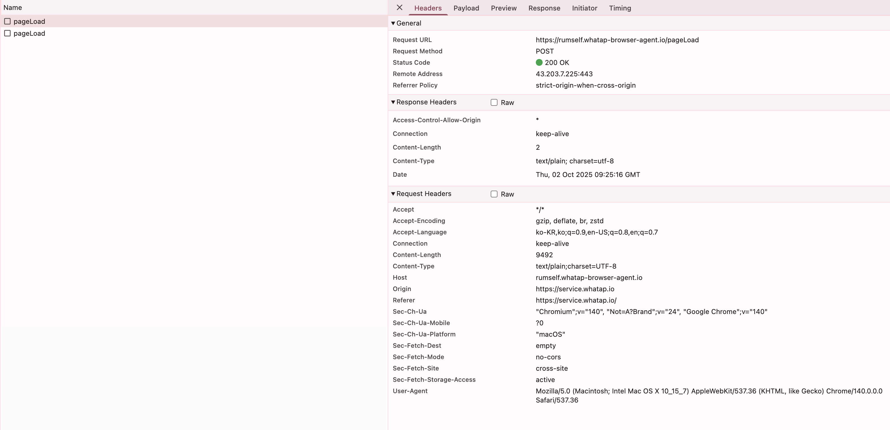

# WhatAp Browser Agent Auto-Injector

Chrome Extension that **automatically injects WhatAp Browser Agent** into every webpage you visit.



## 📋 What It Does

- **Auto-injects** `whatap-browser-agent.js` into every page
- **Runs at `document_start`** to ensure agent loads before page scripts
- **Monitors** XHR/Fetch requests, errors, and user interactions
- **Bypasses CSP** restrictions using Manifest V3 MAIN world injection
- **Easy Configuration** via popup settings UI
- **Works on all websites** including strict CSP sites

## ✨ Key Features

- ✅ **MAIN World Injection** - Runs agent in page context (no CSP `script-src` issues)
- ✅ **CSP Header Modification** - Uses `declarativeNetRequest` to allow Worker & API calls
- ✅ **Settings UI** - Easy configuration via toolbar popup
- ✅ **Enable/Disable Toggle** - Turn agent on/off globally
- ✅ **Blacklist Support** - Exclude specific domains
- ✅ **Persistent Storage** - Settings saved via `chrome.storage.sync`

## 🚀 Quick Start

### 1. Build Extension (Required)

**IMPORTANT**: You must build the extension first to bundle the agent code.

```bash
cd /Users/devload/Documents/whatapBrowserAutoInjectWorkspace
./build-extension.sh
```

**Output:**
```
🔨 Building WhatAp Extension...
📦 Bundling agent code into MAIN world script...
✅ Build complete!
   Agent size: 232K
   Output size: 232K
```

### 2. Load Extension in Chrome

```bash
# Open Chrome Extensions page
# chrome://extensions/

# 1. Toggle "Developer mode" (top-right)
# 2. Click "Load unpacked"
# 3. Select folder:
#    /Users/devload/Documents/whatapBrowserAutoInjectWorkspace/extension
```

### 2. Test Installation

1. Visit any website (e.g., https://example.com)
2. Open DevTools Console (F12)
3. Look for logs:

```
[WhatAp Auto-Inject] Starting injection...
[WhatAp MAIN] Initializing in page context...
[WhatAp Auto-Inject] ✅ Sent config to MAIN world (CSP bypass)
[WhatAp MAIN] Received config, injecting agent...
[WhatAp MAIN] ✅ Agent executed successfully in page context
```

### 3. Verify Agent is Active

```javascript
// In DevTools Console:
console.log(window.WhatapBrowserAgent);
// Output: {config: {projectAccessKey: "...", pcode: 3522, ...}}
```

## 📁 Project Structure

```
whatapBrowserAutoInjectWorkspace/
├── build-extension.sh             # 🆕 Build script (bundles agent)
├── extension/
│   ├── manifest.json              # Chrome Extension config (Manifest V3)
│   ├── whatap-inject.js           # Isolated world (sends config)
│   ├── whatap-inject-main.js      # 🆕 MAIN world (bundled agent - 230KB)
│   ├── whatap-browser-agent.js    # Source agent file (228KB)
│   ├── popup.html                 # Settings UI
│   ├── popup.js                   # Settings logic
│   └── icon.png                   # Extension icon
└── README.md                       # This file
```

**Build Process:**
```
whatap-browser-agent.js (228KB)
         │
         │ build-extension.sh
         ├─────────────────────────►
         │
         ▼
whatap-inject-main.js (230KB)
  = header + agent code + footer
```

## ⚙️ Settings UI

### 🎛️ Easy Configuration (Recommended)

Click the extension icon in Chrome toolbar to open the **Settings Panel**:


**Features:**
- 🔴 **Master Enable/Disable Toggle** - Turn agent on/off for all sites
- 📝 **Project Access Key** - Change your WhatAp project key
- 🔢 **Project Code (pcode)** - Change project code
- 🌐 **Proxy Base URL** - Configure WhatAp server URL
- 📊 **Sample Rate Slider** - Adjust tracking percentage (0-100%)
- ✅ **XHR Tracing Toggle** - Enable/disable request tracking
- ⚠️ **Error Tracking Toggle** - Enable/disable error collection

**How to Use:**
1. Click extension icon in toolbar (⚙️)
2. Modify settings as needed
3. Click "💾 Save Settings"
4. All tabs will reload with new configuration

**Default Settings:**
```javascript
{
  enableAgent: true,
  projectAccessKey: "x43e420hjvmv6-z5qbtlae2q1s0j-z76as5gsgdcp02",
  pcode: 3524,
  sampleRate: 100,              // 100% sampling
  proxyBaseUrl: "https://rumote.whatap-browser-agent.io/",
  agentError: true,             // Track JavaScript errors
  xhrTracing: true              // Track XHR/Fetch requests
}
```

### 🔒 Enable/Disable Agent

**Quick Toggle:**
- Open settings popup
- Use the **Agent Status** toggle at the top
- When **disabled**, agent won't inject on any page
- When **enabled**, agent works normally

**Console Output When Disabled:**
```
[WhatAp Auto-Inject] Starting injection...
[WhatAp Auto-Inject] ⚠️ Agent is disabled - skipping injection
```

## 🧪 Testing

### Test XHR/Fetch Tracking

Open DevTools Console and run:

```javascript
// Test fetch
fetch('https://jsonplaceholder.typicode.com/todos/1')
  .then(res => res.json())
  .then(data => console.log('Fetch test:', data));

// Test XHR
const xhr = new XMLHttpRequest();
xhr.open('GET', 'https://jsonplaceholder.typicode.com/todos/2');
xhr.onload = () => console.log('XHR test:', xhr.responseText);
xhr.send();
```

WhatAp should intercept and log these requests.

### Test with Sample Page

```bash
# Serve test page from webview-page
cd /Users/devload/webview_sample/webview-page
python3 -m http.server 8000

# Visit: http://localhost:8000/index.html
# Extension will auto-inject WhatAp agent
```

### Check Network Activity

1. Open DevTools > Network tab
2. Filter by "rumote.whatap-mobile-agent.io"
3. You should see POST requests with tracked data

## 🔧 How It Works

### 1. Injection Timing
- `run_at: "document_start"` - Executes **before** page DOM construction
- `all_frames: true` - Injects into iframes too

### 2. MAIN World Injection (CSP Bypass)
```javascript
// manifest.json - Two content scripts
{
  "content_scripts": [
    {
      "js": ["whatap-inject.js"],        // Isolated world (chrome API)
      "world": "ISOLATED"
    },
    {
      "js": ["whatap-inject-main.js"],   // Page context (agent bundled!)
      "world": "MAIN"
    }
  ]
}

// whatap-inject.js (isolated world)
window.postMessage({
  type: 'WHATAP_INJECT_CONFIG',
  config: config
}, '*');

// whatap-inject-main.js (MAIN world - agent code bundled inside!)
window.addEventListener('message', (event) => {
  if (event.data.type === 'WHATAP_INJECT_CONFIG') {
    window.WhatapBrowserAgent = { config: event.data.config };
    // Agent code runs here (bundled, no eval!)
  }
});
```

**Why MAIN World + Bundled Code?**
- ✅ **Agent code bundled** in script file (no fetch/eval)
- ✅ Runs in **page context** (not isolated world)
- ✅ **Zero CSP restrictions** (same as page scripts)
- ✅ Works on GitHub, GitLab, StackOverflow, etc.
- ✅ No `blob:` Worker errors
- ✅ Direct `window` object access

### 3. Web Accessible Resources
`manifest.json` allows content script to access the agent file:
```json
"web_accessible_resources": [
  {
    "resources": ["whatap-browser-agent.js"],
    "matches": ["<all_urls>"]
  }
]
```

## 📊 What Gets Tracked

WhatAp Browser Agent monitors:
- ✅ **XHR/Fetch requests** (URL, method, status, timing)
- ✅ **JavaScript errors** (stack traces, line numbers)
- ✅ **User interactions** (clicks, navigation)
- ✅ **Performance metrics** (page load, resource timing)

Data is sent to: `https://rumote.whatap-browser-agent.io/`

## 🐛 Troubleshooting

### Agent Not Loading?

**Check Console:**
```
[WhatAp Auto-Inject] ❌ Failed to load agent from: chrome-extension://...
```

**Solutions:**
1. Verify `whatap-browser-agent.js` exists in `extension/` folder
2. Reload extension in `chrome://extensions/`
3. Check `host_permissions: ["<all_urls>"]` in manifest.json

### Agent Loaded But Not Tracking?

**Verify configuration:**
```javascript
console.log(window.WhatapBrowserAgent.config);
// Should show: {projectAccessKey: "...", pcode: 3522, ...}
```

**Check Network tab:**
- Open DevTools > Network
- Filter by "rumote.whatap-mobile-agent.io"
- Should see POST requests with tracking data

### Content Security Policy (CSP) Limitations

**IMPORTANT**: Some sites have **strict CSP** that cannot be bypassed by extensions.

#### ✅ What We Can Bypass
- `script-src` - Agent code injection works (MAIN world)
- `script-src 'self'` - Bundled code runs successfully

#### ❌ What We CANNOT Bypass
- **`worker-src`** - Agent cannot create Web Workers on strict sites
- **`connect-src`** - Agent cannot send data to WhatAp servers

#### 🔴 GitHub Example
```
✅ Agent code injected successfully
❌ Worker creation blocked: "Refused to create worker from 'blob:...'"
❌ Data transmission blocked: "connect-src does not allow 'rumote.whatap-mobile-agent.io'"
```

**These are browser security restrictions. Extensions cannot override them.**

#### 💡 Solution: Use Blacklist

**Default blacklisted sites** (strict CSP):
- `github.com` - Blocks worker-src, connect-src
- `gitlab.com` - Blocks worker-src, connect-src
- `bitbucket.org` - Blocks worker-src
- `stackoverflow.com` - Blocks worker-src
- `stackexchange.com` - Blocks worker-src

**To modify blacklist:**
1. Click extension icon
2. Scroll to **🚫 Blacklist Domains**
3. Add/remove domains (one per line)
4. Click **💾 Save Settings**

**Sites on blacklist will skip agent injection entirely.**

## 🔒 Privacy Notice

This extension:
- Runs on **all websites** (`<all_urls>`)
- Sends browsing data to **WhatAp servers**
- Configured with **100% sampling** (tracks all sessions)

To reduce tracking:
- Lower `sampleRate` to 10 (10% of sessions)
- Whitelist specific domains in `manifest.json`

## 🛠️ Development

### Update Agent File

```bash
# Replace with new version
cp /path/to/new/whatap-browser-agent.js \
   extension/whatap-browser-agent.js

# Reload extension in chrome://extensions/
```

### Debug Injection

Add logs to `extension/whatap-inject.js`:
```javascript
console.log('[DEBUG] Agent URL:', chrome.runtime.getURL('whatap-browser-agent.js'));
scriptElement.onload = () => console.log('[DEBUG] ✅ Script loaded');
scriptElement.onerror = (e) => console.error('[DEBUG] ❌ Load failed:', e);
```

### Test Different Configurations

Edit `whatapConfig` in `whatap-inject.js`:
```javascript
// Test with lower sampling
sampleRate: 10,  // Track only 10% of sessions

// Disable error tracking
agentError: false,

// Disable XHR tracking
xhrTracing: false,
```

## 📝 Source Files

- **WhatAp Agent**: `/Users/devload/webview_sample/webview-page/whatap-browser-agent.js`
- **Test Page**: `/Users/devload/webview_sample/webview-page/index.html`

## 🎯 Features

- ✅ **MAIN World Injection** - Agent code bundled in page context (bypasses `script-src`)
- ✅ **Settings UI** - Easy configuration via popup
- ✅ **Enable/Disable Toggle** - Turn agent on/off globally
- ✅ **Configuration Panel** - Adjust all WhatAp settings
- ✅ **Blacklist Domains** - Exclude strict CSP sites (GitHub, GitLab, etc.)
- ✅ **Auto-reload on Save** - Changes apply to all tabs immediately
- ⚠️ **CSP Limitations** - Cannot bypass `worker-src`, `connect-src` (browser security)
- [ ] Whitelist mode (only specific domains)
- [ ] Real-time tracking stats in popup
- [ ] Support multiple WhatAp projects
